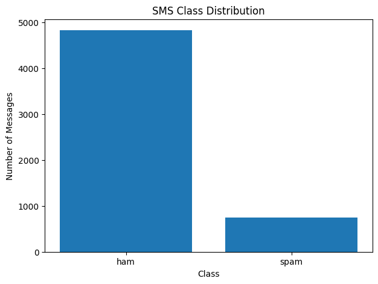
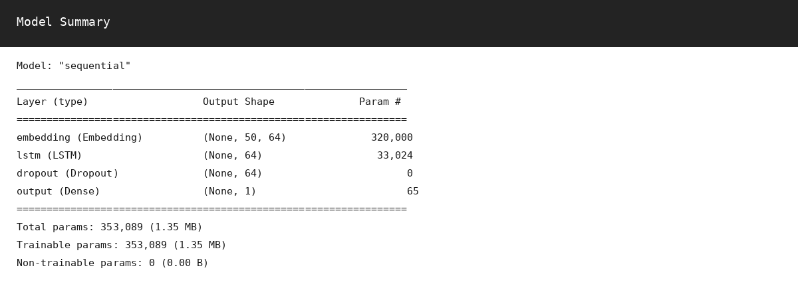
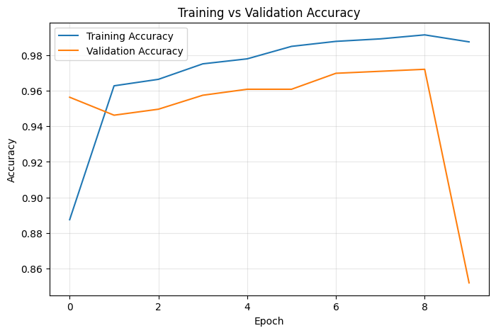
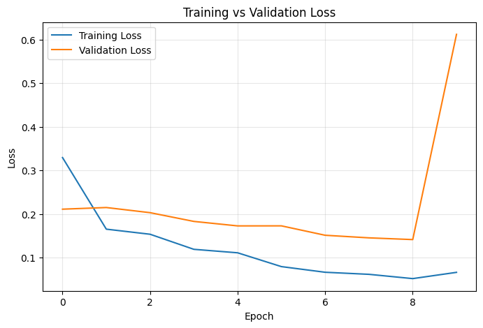
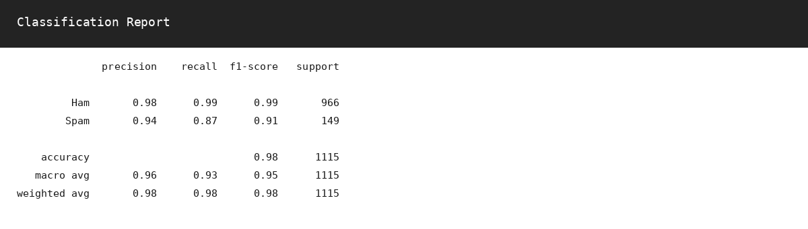
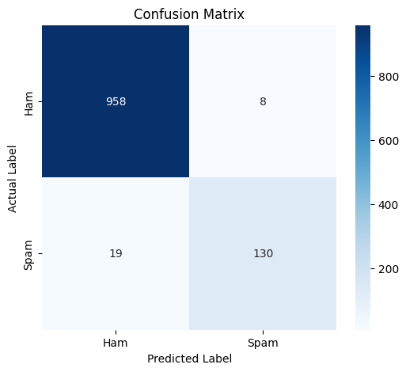
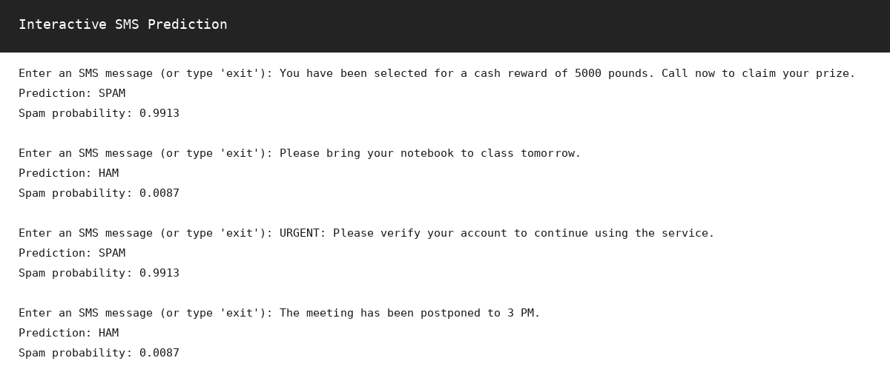

# SMS Spam Detection Using Embedding Layer and LSTM

## Practical No. 02 – Text Classification using Embedding Layer and LSTM

A complete binary text-classification project that detects whether an SMS message is **Ham (legitimate)** or **Spam (unwanted)** using a Keras **Embedding layer + LSTM network**.

> **Course:** Generative AI Lab  
> **Student:** Shreya Dattaram Bhosale  
> **PRN:** 202502110010  
> **Class:** T.Y. B.Tech  
> **Department:** CSE (AI & ML)  
> **Batch:** A3  
> **Submission Date:** 09/09/2026

---

## 1. Objective

Build a binary text-classification model using an **Embedding layer** and an **LSTM network**, then evaluate the trained model using appropriate classification metrics.

The notebook implements the complete workflow:

1. Dataset download and loading
2. Dataset exploration
3. Data cleaning and preprocessing
4. Label encoding
5. Train-test split
6. Tokenization
7. Sequence padding/truncation
8. Embedding + LSTM model construction
9. Model compilation
10. Model training with early stopping
11. Accuracy and loss visualization
12. Evaluation on an unseen test set
13. Classification metrics
14. Classification report
15. Confusion matrix
16. Prediction on new SMS messages

---

## 2. Problem Statement

SMS messages may be legitimate personal/transactional communication or unwanted promotional and fraudulent content. The goal of this project is to automatically classify each message into one of two classes:

- **Ham:** legitimate SMS
- **Spam:** unwanted/spam SMS

This is a **binary text-classification** problem where the input is natural-language SMS text and the target is a binary class label.

---

## 3. Dataset

### SMS Spam Collection Dataset

The notebook uses the **SMS Spam Collection Dataset** and automatically downloads the dataset from the UCI Machine Learning Repository when the local file is not available.

Dataset characteristics recorded in the notebook:

| Property | Value |
|---|---:|
| Total messages | 5,572 |
| Ham messages | 4,825 |
| Spam messages | 747 |
| Number of classes | 2 |
| Task | Binary classification |

The raw dataset contains two fields:

- `label` – `ham` or `spam`
- `message` – SMS text

Dataset loading is performed using a tab-separated format with `latin-1` encoding.

### Class Distribution



The dataset is imbalanced toward the Ham class, with 4,825 Ham messages compared with 747 Spam messages. This makes evaluation using precision, recall and F1-score important in addition to accuracy.

---

## 4. Data Preprocessing

The notebook keeps the original SMS text in the `message` column and creates a cleaned version in `clean_message`.

The preprocessing pipeline includes:

- Convert text to lowercase
- Remove URLs
- Remove punctuation and special characters
- Remove extra spaces
- Remove unexpected missing rows
- Keep only the required `ham` and `spam` classes

Labels are converted to numeric form for model training:

```text
Ham  -> 0
Spam -> 1
```

---

## 5. Train-Test Split

The notebook uses an **80:20 train-test split** with stratification so that the class proportions are preserved in the two sets.

Recorded shapes:

| Dataset | Samples |
|---|---:|
| Training set | 4,457 |
| Test set | 1,115 |

The training set is further divided internally during training using a **20% validation split**.

---

## 6. Tokenization and Sequence Preparation

Natural-language text cannot be passed directly into the LSTM. The notebook therefore uses the Keras `Tokenizer` to convert words into integer IDs.

Configuration recorded in the notebook:

| Parameter | Value |
|---|---:|
| Vocabulary size | 5,000 |
| Maximum sequence length | 50 tokens |
| Padding | `post` |
| Truncation | `post` |
| OOV token | `<OOV>` |

The tokenizer is fitted only on the training text, then both training and test messages are converted to integer sequences. Each sequence is padded or truncated to exactly 50 tokens.

---

## 7. Model Architecture

The model follows this architecture:

```text
Input Sequence
      |
      v
Embedding
      |
      v
LSTM
      |
      v
Dropout
      |
      v
Dense (Sigmoid)
      |
      v
Ham / Spam
```

### Layer Details

| Layer | Configuration | Purpose |
|---|---|---|
| Embedding | 64-dimensional vectors | Learns dense word representations |
| LSTM | 64 units | Learns sequential patterns in SMS text |
| Dropout | 0.30 | Reduces overfitting |
| Dense | 1 unit, sigmoid | Produces spam probability |

### Model Summary Screenshot



The model contains **353,089 trainable parameters**.

---

## 8. Model Compilation

Because this is a binary classification problem, the notebook uses:

- **Optimizer:** Adam
- **Loss:** Binary Crossentropy
- **Metric:** Accuracy

```python
model.compile(
    optimizer="adam",
    loss="binary_crossentropy",
    metrics=["accuracy"]
)
```

---

## 9. Model Training

The model is trained for a maximum of **10 epochs** with a batch size of **32**.

Early stopping is configured as:

- Monitor: `val_loss`
- Patience: `2`
- Restore best weights: `True`

The recorded training output shows validation accuracy reaching approximately **97.20%** before the final epoch deteriorates, while early stopping restores the best validation model.

---

## 10. Training Accuracy Curve



The accuracy curve compares training accuracy with validation accuracy over the training epochs. It helps assess learning behaviour and identify signs of overfitting or underfitting.

---

## 11. Training Loss Curve



The loss curve compares training loss with validation loss. The notebook uses the validation loss as the early-stopping signal so the model can retain its best-performing weights rather than simply using the final epoch.

---

## 12. Evaluation on Unseen Test Data

The final evaluation is performed on the held-out test set of **1,115 messages**.

Recorded test results:

| Metric | Score |
|---|---:|
| Test Loss | 0.1233 |
| Test Accuracy | 0.9758 |
| Accuracy | 97.58% |
| Precision | 94.20% |
| Recall | 87.25% |
| F1-Score | 90.59% |

The test accuracy shows that the model correctly classifies the large majority of unseen SMS messages.

---

## 13. Classification Metrics

The notebook evaluates the model using four main metrics:

### Accuracy

The proportion of all test examples classified correctly.

### Precision

For the positive Spam class, precision measures how many messages predicted as Spam are actually Spam.

### Recall

For the Spam class, recall measures how many of the actual Spam messages are successfully detected.

### F1-Score

The F1-score is the harmonic mean of precision and recall and gives a balanced view when both false positives and false negatives matter.

---

## 14. Classification Report



The recorded classification report is:

| Class | Precision | Recall | F1-Score | Support |
|---|---:|---:|---:|---:|
| Ham | 0.98 | 0.99 | 0.99 | 966 |
| Spam | 0.94 | 0.87 | 0.91 | 149 |
| Accuracy | | | 0.98 | 1,115 |
| Macro Average | 0.96 | 0.93 | 0.95 | 1,115 |
| Weighted Average | 0.98 | 0.98 | 0.98 | 1,115 |

The Spam class has a recall of **0.87**, meaning some Spam messages are still missed. This is visible in the confusion matrix through the false-negative count.

---

## 15. Confusion Matrix



The recorded confusion matrix is:

```text
[[958   8]
 [ 19 130]]
```

Interpreting the matrix:

| Quantity | Value |
|---|---:|
| True Negatives (TN) | 958 |
| False Positives (FP) | 8 |
| False Negatives (FN) | 19 |
| True Positives (TP) | 130 |

This indicates that the model correctly classified 958 Ham messages as Ham and 130 Spam messages as Spam. Eight Ham messages were incorrectly marked as Spam, while 19 Spam messages were incorrectly classified as Ham.

---

## 16. Interactive SMS Prediction

The notebook includes a prediction function that:

1. Cleans the input message
2. Converts it into a token sequence
3. Pads it to the configured sequence length
4. Passes it through the trained LSTM model
5. Converts the predicted probability into `HAM` or `SPAM`
6. Displays the Spam probability



Recorded examples from the notebook include:

| Sample | Prediction | Spam Probability |
|---|---|---:|
| Cash reward / prize message | SPAM | 0.9913 |
| Bring notebook to class tomorrow | HAM | 0.0087 |
| Urgent account verification message | SPAM | 0.9913 |
| Meeting postponed to 3 PM | HAM | 0.0087 |

---

## 17. Project Structure

```text
SMS-Spam-Detection/
│
├── Shreya_Bhosale_Generative_AI_Pr_2.ipynb
├── README.md
├── SMSSpamCollection
└── screenshots/
    ├── 01_class_distribution.png
    ├── 02_model_summary.png
    ├── 03_accuracy_curve.png
    ├── 04_loss_curve.png
    ├── 05_confusion_matrix.png
    ├── 06_classification_report.png
    └── 07_sample_prediction.png
```

The dataset file does not need to be included when the notebook is able to download it automatically. If internet access is unavailable, the `SMSSpamCollection` file can be placed beside the notebook manually.

---

## 18. Requirements

Install the main Python packages used by the notebook:

```bash
pip install tensorflow pandas numpy scikit-learn matplotlib seaborn
```

The notebook was run with TensorFlow **2.20.0** in the recorded execution environment.

---

## 19. How to Run

### Google Colab

1. Upload the notebook to Google Colab.
2. Run the dependency-installation cell if required.
3. Run all notebook cells from top to bottom.
4. Allow the dataset download cell to download the SMS Spam Collection dataset.
5. Inspect the preprocessing, model, training and evaluation sections.
6. Use the interactive prediction section to test new SMS messages.

### Local Jupyter Notebook

```bash
jupyter notebook
```

Open the `.ipynb` file and execute the cells sequentially.

---

## 20. Key Learning Outcomes

After completing this practical, the following concepts are demonstrated:

- Text preprocessing for deep learning
- Natural-language tokenization
- Vocabulary construction
- Integer sequence generation
- Sequence padding and truncation
- Embedding representations
- LSTM-based sequential modelling
- Dropout regularization
- Sigmoid-based binary classification
- Adam optimization
- Binary crossentropy loss
- Early stopping
- Training and validation monitoring
- Accuracy, precision, recall and F1-score
- Classification report interpretation
- Confusion matrix interpretation
- Inference on unseen SMS messages

---

## 21. Advantages of the Approach

The Embedding + LSTM approach is useful for SMS classification because the model can learn representations of words and their sequence relationships directly from the training data. The notebook also combines multiple evaluation metrics rather than relying only on accuracy, which is important because the dataset contains considerably more Ham messages than Spam messages.

---

## 22. Limitations

The notebook uses a relatively compact LSTM architecture and a fixed maximum sequence length of 50 tokens. Some long or unusual SMS messages may therefore lose information through truncation. The dataset is also imbalanced toward the Ham class, and the recorded Spam recall of 0.87 indicates that a portion of Spam messages remains difficult to detect.

---

## 23. Conclusion

The SMS Spam Detection model successfully implements binary text classification using an **Embedding layer and LSTM network**. The project covers the complete pipeline from dataset loading and preprocessing through tokenization, padding, model construction, training, evaluation and prediction.

The recorded model achieves **97.58% test accuracy**, **94.20% precision**, **87.25% recall**, and **90.59% F1-score**. The classification report and confusion matrix provide a detailed view of performance on Ham and Spam messages, while the interactive prediction section demonstrates how the trained model can be used on new SMS inputs.

---

## 24. Author

**Shreya Dattaram Bhosale**  
T.Y. B.Tech – CSE (AI & ML)  
Generative AI Lab  
PRN: 202502110010
